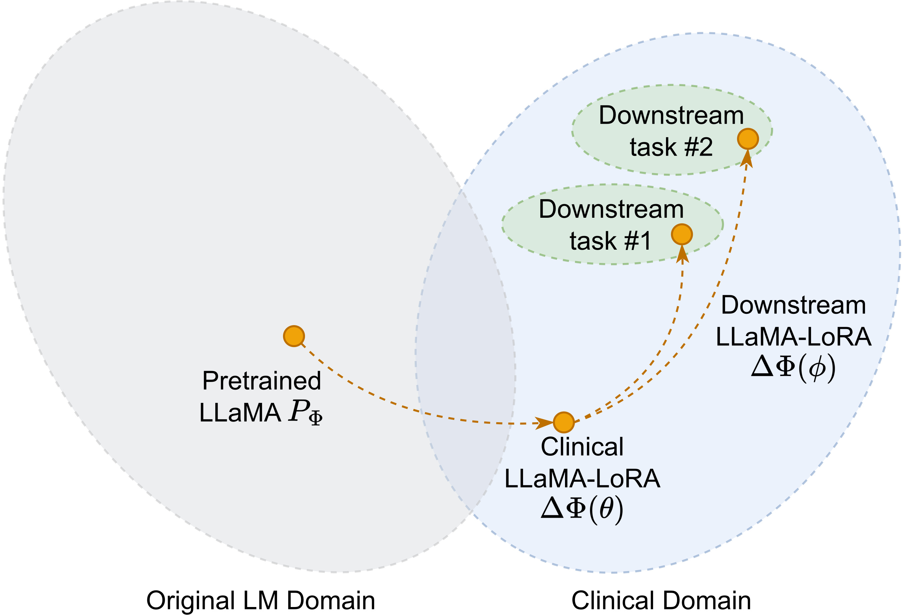
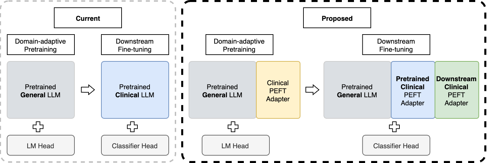
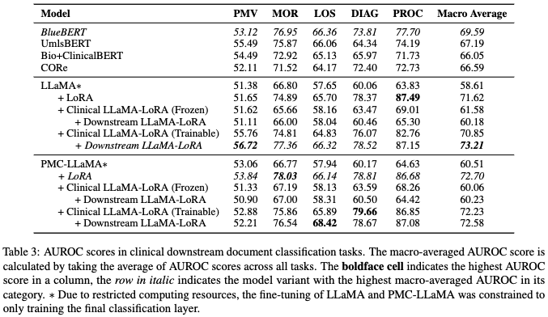

<!-- omit in toc -->
# Parameter-Efficient Fine-Tuning LLaMA for the Clinical Domain

This repository contains the code for domain adaptation fine-tuning, downstream fine-tuning, and evaluation for "Parameter-Efficient Fine-Tuning LLaMA for the Clinical Domain" (in submission)



<!-- omit in toc -->
## Table of Contents
- [⚡ Abstract](#-abstract)
- [🛠️ Setup](#️-setup)
  - [Cloning the codebase](#cloning-the-codebase)
  - [Python packages](#python-packages)
  - [Environment variables](#environment-variables)
- [💾 Dataset](#-dataset)
  - [Domain adaptation fine-tuning](#domain-adaptation-fine-tuning)
  - [Downstream fine-tuning](#downstream-fine-tuning)
- [🤖 Training](#-training)
  - [Prepare the MIMIC-IV dataset](#prepare-the-mimic-iv-dataset)
  - [Prepare the downstream datasets](#prepare-the-downstream-datasets)
  - [Domain adaptation fine-tuning](#domain-adaptation-fine-tuning-1)
  - [Downstream fine-tuning](#downstream-fine-tuning-1)
    - [Baseline models](#baseline-models)
    - [Clinical LLaMA-LoRA](#clinical-llama-lora)
- [⚖️ Results](#️-results)
  - [Domain adaptation fine-tuning](#domain-adaptation-fine-tuning-2)
  - [Downstream fine-tuning](#downstream-fine-tuning-2)
    - [Main results](#main-results)
    - [Baseline models + LoRA](#baseline-models--lora)


## ⚡ Abstract

Adapting pretrained language models to novel domains, such as clinical applications, traditionally involves retraining their entire parameters.
However, this approach is increasingly proven to be impractical owing to the substantial computational requirements associated with training such large language models.
To address this issue, Parameter-Efficient Fine-Tuning (PEFT) techniques offer a solution by selectively fine-tuning a small subset of additional parameters, significantly reducing the computational requirements for domain adaptation.
In this study, we propose Clinical LLaMA-LoRA, a PEFT adapter layer built upon the open-sourced LLaMA model.
Clinical LLaMA-LoRA is trained using clinical notes obtained from the MIMIC-IV database, thereby creating a specialised adapter designed for the clinical domain.
Additionally, we propose a two-step PEFT framework which fuses Clinical LLaMA-LoRA with Downstream LLaMA-LoRA, another PEFT adapter specialised for downstream tasks.
We evaluate this framework on multiple clinical outcome prediction benchmark datasets, comparing it to clinically trained language models.
Our proposed framework achieves the state-of-the-art AUROC score averaged across all clinical downstream tasks.
We observe pronounced improvements of 6-9\% AUROC score in the extreme multilabel classification tasks, such as diagnoses and procedures classification.



## 🛠️ Setup
### Cloning the codebase

As we rely on a specific version of [PEFT](https://github.com/huggingface/peft), we opt into using git submodule.
Consequently, you have to clone this repo with a `--recurse-submodules` flag:

```
git clone --recurse-submodules https://github.com/aryopg/clinical_peft.git
```

### Python packages
This codebase requires multiple dependencies.
<details>
<summary>Dependencies</summary>

```
- pip
- numpy
- pandas
- pytorch
- transformers
- datasets
- huggingface-hub
- evaluate
- pydantic
- scikit-learn
- python-dotenv
- black
- isort
- PyYAML
- tqdm
- wandb
- jupyterlab
- matplotlib
- peft
```
</details>

We opted in to using conda as our package manager. The following will install the necessary dependencies for a GPU training:
```
ENV_NAME=clinical_peft
conda env create -f environment.yml
conda activate ${ENV_NAME}
```

### Environment variables

There are multiple environment variables required to run the training:

- **WANDB_API_KEY**: The authorisation key to access your WandB projects
- **WANDB_PROJECT_NAME**: The name that you like for this project
- **WANDB_ENTITY**: The WandB entity that will host the project
- **HF_DOWNLOAD_TOKEN**: Download token for Huggingface
- **HF_UPLOAD_TOKEN**: Upload token for Huggingface
- **HF_USERNAME**: Your HuggingFace username

We use the `python-dotenv` package to load these environment variables. To set them:

```
mkdir env
nano env/.env
```

Write down all of the mentioned environment variables with the appropriate values inside that file.
Certainly, you don't have to use `nano`, as long as the file name (`env/.env`) remain the same.

## 💾 Dataset


### Domain adaptation fine-tuning

A combination of [**MIMIC-IV**](https://physionet.org/content/mimic-iv-note/2.2/) de-identified **discharge summaries (331,794)** and **radiology reports (2,321,355)**, resulting in a collection of **2,653,149 individual clinical notes**.

### Downstream fine-tuning


- **Length of stay (LOS)**: a multiclass classification task to predict the length of a patient’s hospital stay, categorised into four time-bins: less than three days, three to seven days, one to two weeks, and more than two weeks ([van Aken et al., 2021](https://aclanthology.org/2021.eacl-main.75/)).
- **In-hospital mortality (MOR)**: a binary classification task to predict whether a patient will survive during their hospital stay ([van Aken et al., 2021](https://aclanthology.org/2021.eacl-main.75/)).
- **Prolonged mechanical ventilation (PMV)**: a binary classification task to predict whether a 282 patient will require mechanical ventilation for 283 more than seven days ([Huang et al., 2020](https://aclanthology.org/2020.clinicalnlp-1.11/)).
- **Diagnoses (DIAG)**: an extreme multilabel classification task to predict the differential diagnoses associated with a patient, represented by simplified ICD-9 diagnosis codes ([van Aken et al., 2021](https://aclanthology.org/2021.eacl-main.75/)).
- **Procedures (PROC)**: an extreme multilabel classification task to predict the diagnostics or treatments administered to a patient, represented by simplified ICD-9 procedure codes ([van Aken et al., 2021](https://aclanthology.org/2021.eacl-main.75/)).

## 🤖 Training

### Prepare the MIMIC-IV dataset

1. Obtain and extract the [MIMIC-IV clinical notes](https://physionet.org/content/mimic-iv-note/2.2/). The files of interest are `discharge.csv.gz` and `radiology.csv.gz`
2. Run `python scripts/prepare_mimic_iv.py --dataset_dir PATH/TO/MIMIC-IV-DIR`
3. The previous script will create the training data with extension `.txt.gz` in the same directory as the raw datasets

### Prepare the downstream datasets

1. For all datasets, you need to obtain the [MIMIC-III clinical notes](https://physionet.org/content/mimiciii/1.4/)
2. Once you've obtained and extracted them:
   1. **LOS, MOR, and PMV**: we use the instruction provided by [**BEEP**](https://github.com/allenai/BEEP/tree/main#creating-outcome-prediction-datasets) repository
   2. **DIAG, PROC**: we use the instruction provided by [**CORe**](https://github.com/bvanaken/clinical-outcome-prediction#create-admission-notes-for-outcome-prediction-from-mimic-iii) repository

### Domain adaptation fine-tuning

We use [Accelerate](https://huggingface.co/docs/accelerate/index) to run the model training.
To launch a training, you need to specify the right config file which can be found in the `configs/mimic_pretrain_hpo_configs/` directory. For example:

```
accelerate launch --mixed_precision=fp16 scripts/train.py --config_filepath configs/mimic_pretrain_hpo_configs/llama_lora.yaml
```

### Downstream fine-tuning

#### Baseline models

```
accelerate launch --mixed_precision=fp16 scripts/train.py --config_filepath configs/downstream_hpo_configs/***<TASK_OF_INTEREST>***/bioclinicalbert_baseline.yaml
accelerate launch --mixed_precision=fp16 scripts/train.py --config_filepath configs/downstream_hpo_configs/***<TASK_OF_INTEREST>***/bluebert_baseline.yaml
accelerate launch --mixed_precision=fp16 scripts/train.py --config_filepath configs/downstream_hpo_configs/***<TASK_OF_INTEREST>***/core_baseline.yaml
accelerate launch --mixed_precision=fp16 scripts/train.py --config_filepath configs/downstream_hpo_configs/***<TASK_OF_INTEREST>***/umlsbert_baseline.yaml
```

#### Clinical LLaMA-LoRA

## ⚖️ Results

### Domain adaptation fine-tuning


### Downstream fine-tuning

#### Main results


#### Baseline models + LoRA

